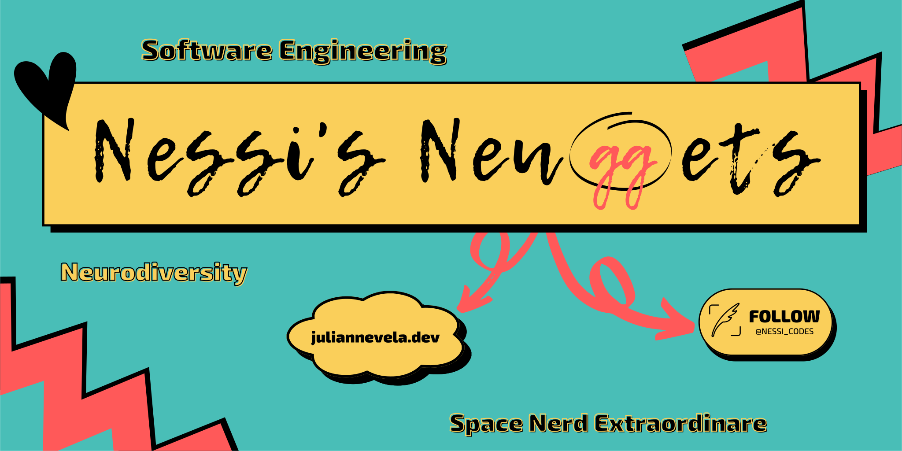

<!-- Intro + Bio -->
<section align="center">
    <h1>Hello. I'm Juli (aka Nessi). Nice to meet you! &#128055;</h1>
    <p>
        I'm a full-stack software engineer with a passion for learning &#129504;, diving down rabbit holes &#128007;&#128371;, and exploring our vast universe &#128301;. <br>Oh, and I have a penchant for <del>terrible</del> awesome jokes!
    </p>

<!-- Reason I code -->
<p>
    <h3>I code to:</h3>
    <p>&#127758; help save the planet &#127758;</p>
    <p>&#128154;&#127895; raise awareness for mental health &#127895;&#128154;</p>
    <p>&#127752; &#129504; and encourage other neurodiverse womxn along the way &#129504; &#127752;</p>
</p>

<!-- Currently Learning -->
<p>
    <h3>I'm currently Learning:</h3>
    &#8195;
    &#8195;
    &#8195;
    &#8195;
</p>

</section>
<hr>

<!-- Teck Stack -->

```javascript
let teckStack = {
    languages: ['JavaScript', 'HTML', 'CSS', 'Python', 'TypeScript'],
    libraries: ['React', 'Node.js', 'Express', 'Next.js', 'Bolt.js'],
    database_api: ['PostgreSQL', 'MongoDB', 'GraphQL', 'Postman/ThunderClient'],
    dev_tools: ['Git', 'Github', 'EsLint', 'Prettier', 'Heroku', 'Netlify'],
    testing: ['Jest', 'Test Driven Development'],
}
```

<hr>

<!-- Connect with Me! -->
<!-- https://img.shields.io/badge/<LABEL>-<MESSAGE>-<COLOR> -->
<section align="center">
    <h2>Let's Connect!</h2> 
    <p>
        <a href="https://www.linkedin.com/in/juliannevela">
            
        </a>
        <a href="https://www.twitter.com/nessi_codes">
            
        </a>
        <a href="https://www.github.com/juliannevela">
            
        </a>
    </p>
    <p>
        ...or feel free to shoot me an email! (opens directly)<br>
        &#128236; <a href="mailto:hello@juliannevela.dev">hello@juliannevela.dev</a>
    </p>
    <p>
        And, feel free to check out my portfolio here: <a href="https://juliannevela.dev">juliannevela.dev</a>
    </p>
</section>
<hr>

<!-- Programming Humor -->
<section align="center">
<h2>Oh, and before you go... &#129315;</h2>

</section>
<hr>

<!-- Signoff -->
<section align="center">
    <h2>Happy Coding and Clear Skies!</h2>

:new_moon_with_face:&#8195;:waxing_crescent_moon:&#8195;:first_quarter_moon_with_face:&#8195;:waxing_gibbous_moon:&#8195;:full_moon_with_face:&#8195;:waning_gibbous_moon:&#8195;:last_quarter_moon_with_face:&#8195;:waning_crescent_moon:&#8195;:new_moon_with_face:&#8195;

</section>
<hr>

<!-- BLOG-POST-LIST:START -->
<!-- BLOG-POST-LIST:END -->
